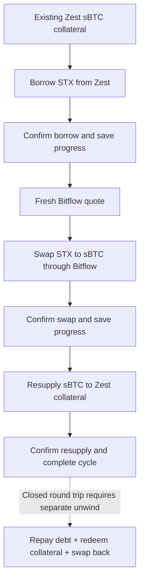

# Bitflow + Zest sBTC Leverage Cycle

## What it does

`bitflow-zest-sbtc-leverage-cycle` executes exactly one forward leverage cycle:
borrow STX against existing Zest sBTC collateral, swap the borrowed STX to sBTC
through Bitflow, then resupply the received sBTC to Zest collateral.

This is not a closed loop. Closing the position requires a separate unwind flow:
repay debt, redeem collateral, and optionally swap back.

It saves progress between every confirmed write leg so agents can detect and
stop on partial-cycle state instead of blindly starting a new cycle.

## Why agents need it

Leveraged sBTC is not a single contract call. An agent needs confirmation,
fresh quote handling, and saved progress across borrow, swap, and resupply.
This submitted version currently proves the contract sequence directly inside
the controller. Final primitive-composition proof still requires reworking the
cycle to orchestrate the standalone borrow, swap, and deposit primitive skills.

## Cycle steps

1. Start with existing sBTC collateral in Zest.
2. Borrow STX from Zest against that collateral.
3. Wait for the borrow transaction to confirm and save progress.
4. Fetch a fresh Bitflow quote.
5. Swap STX to sBTC through Bitflow.
6. Wait for the swap transaction to confirm and save progress.
7. Resupply the received sBTC into Zest collateral.
8. Wait for the resupply transaction to confirm and mark the cycle complete.



## Safety notes

- This is a write skill.
- It creates debt and moves funds.
- It is mainnet-only.
- `run` requires `--confirm=CYCLE`.
- The controller runs one forward cycle only. It does not auto-loop and does not close/unwind the position.
- The swap quote is fetched only after borrow confirmation.
- Every write leg uses `PostConditionMode.Deny`.
- Saved progress is written before and after each broadcast.
- If any leg fails or returns an unknown status, the controller blocks with a
  partial-cycle saved state.

## Commands

### doctor

Checks Zest V2 ABI readiness, Bitflow availability, wallet gas, pending
transaction depth, and saved cycle state.

```bash
bun run skills/bitflow-zest-sbtc-leverage-cycle/bitflow-zest-sbtc-leverage-cycle.ts doctor --wallet <stacks-address>
```

### status

Reads the wallet's Zest position, sBTC balance, STX debt, and current saved cycle
state. It never broadcasts.

```bash
bun run skills/bitflow-zest-sbtc-leverage-cycle/bitflow-zest-sbtc-leverage-cycle.ts status --wallet <stacks-address>
```

### plan

Previews one cycle and fetches a current Bitflow STX to sBTC quote. It never
broadcasts.

```bash
bun run skills/bitflow-zest-sbtc-leverage-cycle/bitflow-zest-sbtc-leverage-cycle.ts plan --wallet <stacks-address> --borrow-amount-ustx <uSTX>
```

### run

Executes one confirmed borrow, swap, and resupply cycle. It refuses without
explicit confirmation.

```bash
bun run skills/bitflow-zest-sbtc-leverage-cycle/bitflow-zest-sbtc-leverage-cycle.ts run --wallet <stacks-address> --borrow-amount-ustx <uSTX> --confirm=CYCLE
```

Useful safety options:

- `--pyth-max-fee-ustx <uSTX>` sets the maximum STX the borrow leg may spend on Pyth oracle fees. The default is `10`.
- `--fee-ustx <uSTX>` sets the transaction fee used for each write leg.

### resume

Reports the existing saved state. It can continue from a confirmed borrow or
confirmed swap state only after `--confirm=CYCLE`.

```bash
bun run skills/bitflow-zest-sbtc-leverage-cycle/bitflow-zest-sbtc-leverage-cycle.ts resume --wallet <stacks-address>
```

### cancel

Marks an unresolved saved state as operator-cancelled after review.

```bash
bun run skills/bitflow-zest-sbtc-leverage-cycle/bitflow-zest-sbtc-leverage-cycle.ts cancel --wallet <stacks-address>
```

## Output contract

All commands print one JSON object to stdout.

Success:

```json
{
  "status": "success",
  "action": "plan",
  "data": {},
  "error": null
}
```

Blocked:

```json
{
  "status": "blocked",
  "action": "run",
  "data": {},
  "error": {
    "code": "CONFIRMATION_REQUIRED",
    "message": "This write skill requires explicit confirmation.",
    "next": "Re-run with --confirm=CYCLE."
  }
}
```

## Known constraints

- Requires existing Zest V2 sBTC collateral before running.
- Current implementation directly builds the Zest V2 market borrow and
  supply-collateral-add calls.
- Uses Bitflow SDK routing for STX to sBTC.
- Final primitive-composition proof requires calling the standalone Zest borrow,
  Bitflow swap, and Zest deposit primitive skill surfaces instead of recreating
  their transaction logic here.
- Does not repay, unwind, withdraw collateral, or manage HODLMM LP bins.
- Does not claim HODLMM integration unless the produced Bitflow route proof
  demonstrates a HODLMM path.
