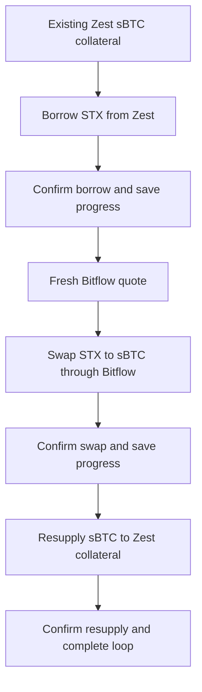

# Bitflow + Zest sBTC Leverage Loop

## What it does

`bitflow-zest-sbtc-leverage-loop` executes exactly one full leverage loop:
borrow STX against existing Zest sBTC collateral, swap the borrowed STX to sBTC
through Bitflow, then resupply the received sBTC to Zest collateral.

It saves progress between every confirmed write leg so agents can detect and
stop on partial-cycle state instead of blindly starting a new cycle.

## Why agents need it

Leveraged sBTC is not a single contract call. An agent needs confirmation,
fresh quote handling, and checkpointing across borrow, swap, and resupply. This
skill provides that controller surface after the individual Zest borrow and
Zest deposit primitives have been proven.

## Loop steps

1. Start with existing sBTC collateral in Zest.
2. Borrow STX from Zest against that collateral.
3. Wait for the borrow transaction to confirm and save progress.
4. Fetch a fresh Bitflow quote.
5. Swap STX to sBTC through Bitflow.
6. Wait for the swap transaction to confirm and save progress.
7. Resupply the received sBTC into Zest collateral.
8. Wait for the resupply transaction to confirm and mark the loop complete.



## Safety notes

- This is a write skill.
- It creates debt and moves funds.
- It is mainnet-only.
- `run` requires `--confirm=CYCLE`.
- The controller runs one cycle only. It does not auto-loop.
- The swap quote is fetched only after borrow confirmation.
- Every write leg uses `PostConditionMode.Deny`.
- A checkpoint is written before and after each broadcast.
- If any leg fails or returns an unknown status, the controller blocks with a
  partial-cycle checkpoint.

## Commands

### doctor

Checks Zest V2 ABI readiness, Bitflow availability, wallet gas, pending
transaction depth, and checkpoint state.

```bash
bun run skills/bitflow-zest-sbtc-leverage-loop/bitflow-zest-sbtc-leverage-loop.ts doctor --wallet <stacks-address>
```

### status

Reads the wallet's Zest position, sBTC balance, STX debt, and current checkpoint
state. It never broadcasts.

```bash
bun run skills/bitflow-zest-sbtc-leverage-loop/bitflow-zest-sbtc-leverage-loop.ts status --wallet <stacks-address>
```

### plan

Previews one cycle and fetches a current Bitflow STX to sBTC quote. It never
broadcasts.

```bash
bun run skills/bitflow-zest-sbtc-leverage-loop/bitflow-zest-sbtc-leverage-loop.ts plan --wallet <stacks-address> --borrow-amount-ustx <uSTX>
```

### run

Executes one confirmed borrow, swap, and resupply cycle. It refuses without
explicit confirmation.

```bash
bun run skills/bitflow-zest-sbtc-leverage-loop/bitflow-zest-sbtc-leverage-loop.ts run --wallet <stacks-address> --borrow-amount-ustx <uSTX> --confirm=CYCLE
```

### resume

Reports the existing checkpoint. It can continue from a confirmed borrow or
confirmed swap checkpoint only after `--confirm=CYCLE`.

```bash
bun run skills/bitflow-zest-sbtc-leverage-loop/bitflow-zest-sbtc-leverage-loop.ts resume --wallet <stacks-address>
```

### cancel

Marks an unresolved checkpoint as operator-cancelled after review.

```bash
bun run skills/bitflow-zest-sbtc-leverage-loop/bitflow-zest-sbtc-leverage-loop.ts cancel --wallet <stacks-address>
```

## Output contract

All commands print one JSON object to stdout.

Success:

```json
{
  "status": "success",
  "action": "plan",
  "data": {},
  "error": null
}
```

Blocked:

```json
{
  "status": "blocked",
  "action": "run",
  "data": {},
  "error": {
    "code": "CONFIRMATION_REQUIRED",
    "message": "This composed write skill requires explicit confirmation.",
    "next": "Re-run with --confirm=CYCLE."
  }
}
```

## Known constraints

- Requires existing Zest V2 sBTC collateral before running.
- Uses the proven Zest V2 market borrow and supply-collateral-add paths.
- Uses Bitflow SDK routing for STX to sBTC.
- Does not repay, unwind, withdraw collateral, or manage HODLMM LP bins.
- Does not claim HODLMM integration unless the produced Bitflow route proof
  demonstrates a HODLMM path.
